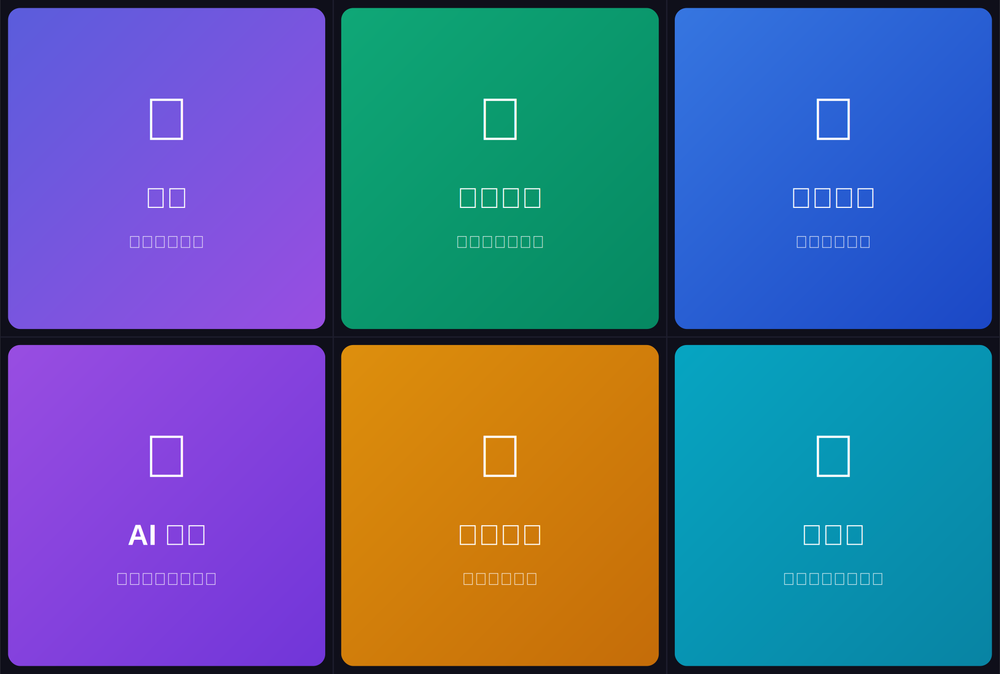

# 🎓 講師工作坊管理系統 + LINE Bot

一站式工作坊管理 SaaS，整合 LINE Bot 讓管理員透過手機即時掌控所有功能。



## ✨ 功能特色

### 🌐 網頁版
- 📅 活動管理 - 建立/編輯工作坊活動
- 📝 公開報名表 - 自動產生報名連結
- 🤖 AI 文宣產生 - Gemini API 智慧生成
- 📨 通知中心 - Email/LINE 發送提醒
- 🏆 PDF 證書 - 批次產生結業證書
- 📊 數據儀表板 - 即時報名統計

### 📱 LINE Bot
- 📊 **總覽** - 查看活動統計
- 📅 **活動列表** - Carousel 卡片展示
- 📋 **最新報名** - 即時報名動態
- 🎨 **AI 文宣** - 一鍵生成宣傳文案
- 🔐 **管理員驗證** - 白名單權限控制

## 🚀 快速部署

### Step 1: LINE Bot 設定

1. 前往 [LINE Developers Console](https://developers.line.biz/console/)
2. 建立 Provider → 建立 Messaging API Channel
3. 在 Basic settings 取得：
   - **Channel Secret**
4. 在 Messaging API 取得：
   - **Channel Access Token**（點擊 Issue）
5. 關閉自動回覆：
   - LINE Official Account features → Auto-reply messages → **Disabled**

### Step 2: 部署到 Render

1. Fork 此 repo 到你的 GitHub
2. 前往 [Render Dashboard](https://dashboard.render.com/)
3. **New** → **Web Service**
4. 連結你的 GitHub repo
5. 設定：
   - **Name**: `workshop-manager-bot`
   - **Environment**: `Node`
   - **Build Command**: `npm install`
   - **Start Command**: `npm start`
6. 新增環境變數：

| Key | Value |
|-----|-------|
| `LINE_CHANNEL_ACCESS_TOKEN` | 你的 Token |
| `LINE_CHANNEL_SECRET` | 你的 Secret |
| `GEMINI_API_KEY` | [取得](https://makersuite.google.com/app/apikey) |
| `ADMIN_USER_IDS` | 管理員 User ID（見下方說明）|

7. **Create Web Service**

### Step 3: 設定 Webhook

1. 複製 Render 給你的網址，例如：`https://workshop-manager-bot.onrender.com`
2. 回到 LINE Developers Console
3. Messaging API → Webhook URL：
   ```
   https://workshop-manager-bot.onrender.com/webhook
   ```
4. 點擊 **Verify** 確認連線成功
5. 開啟 **Use webhook**

### Step 4: 取得管理員 ID

1. 加入你的 LINE Bot 好友
2. 傳送 `myid` 或 `我的ID`
3. Bot 會回覆你的 User ID
4. 將 ID 加入 Render 環境變數 `ADMIN_USER_IDS`

### Step 5: 設定 Rich Menu

#### 方法一：使用腳本（推薦）

```bash
# 設定環境變數
export LINE_CHANNEL_ACCESS_TOKEN=你的token

# 執行設定腳本
node rich-menu-setup.js create
```

#### 方法二：手動設定

1. 用 [LINE Official Account Manager](https://manager.line.biz/)
2. 聊天室相關 → Rich Menu
3. 建立選單，上傳 `rich-menu.png`
4. 設定每格按鈕動作：
   - 格1: 傳送訊息「總覽」
   - 格2: 傳送訊息「活動列表」
   - 格3: 傳送訊息「最新報名」
   - 格4: 傳送訊息「生成文宣」
   - 格5: 傳送訊息「說明」
   - 格6: 開啟網址（你的網頁版網址）

## 📖 Bot 指令列表

| 指令 | 說明 |
|------|------|
| `總覽` | 查看系統統計儀表板 |
| `活動列表` / `活動` | 顯示所有活動（Carousel） |
| `活動詳情 {ID}` | 查看特定活動詳細資訊 |
| `最新報名` / `報名` | 顯示最近 5 筆報名 |
| `生成文宣` | 選擇活動生成 AI 文宣 |
| `生成文宣 {ID}` | 直接為特定活動生成文宣 |
| `說明` / `help` | 查看使用說明 |
| `myid` | 取得你的 User ID |

## 🔧 API 端點

| Method | Endpoint | 說明 |
|--------|----------|------|
| GET | `/api/events` | 取得所有活動 |
| POST | `/api/events` | 新增活動 |
| GET | `/api/registrations` | 取得所有報名 |
| POST | `/api/registrations` | 新增報名 |
| POST | `/webhook` | LINE Webhook |

## 📁 專案結構

```
workshop-bot/
├── server.js           # 主程式（Express + LINE Bot）
├── rich-menu-setup.js  # Rich Menu 建立腳本
├── rich-menu.svg       # Rich Menu 設計圖
├── package.json        # 依賴套件
├── render.yaml         # Render 部署設定
├── .env.example        # 環境變數範本
└── public/
    └── index.html      # 網頁前端
```

## 🔐 安全性

- 管理員白名單驗證
- LINE Signature 驗證
- 環境變數保護敏感資訊

## 📝 License

MIT

---

Made with ❤️ for Workshop Instructors
